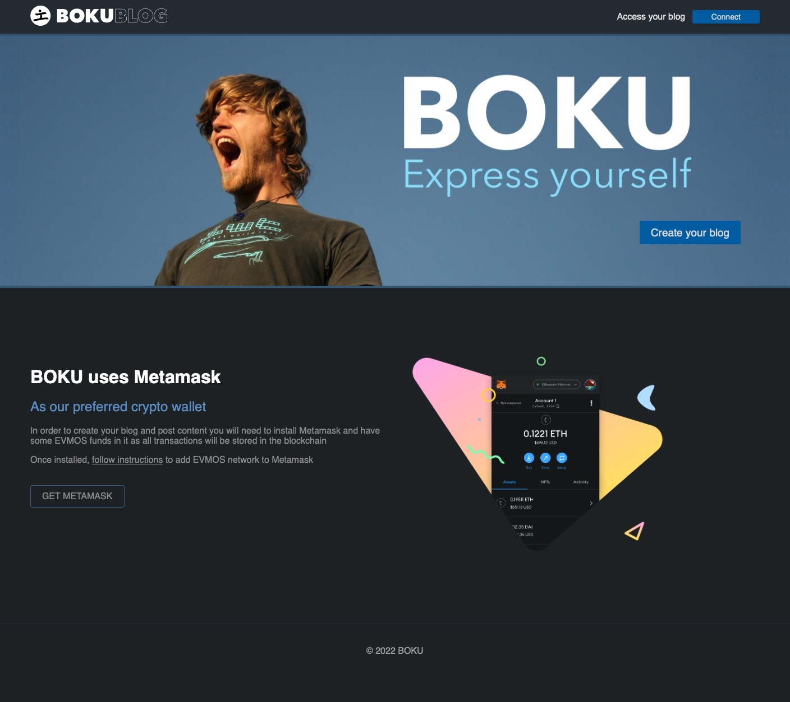
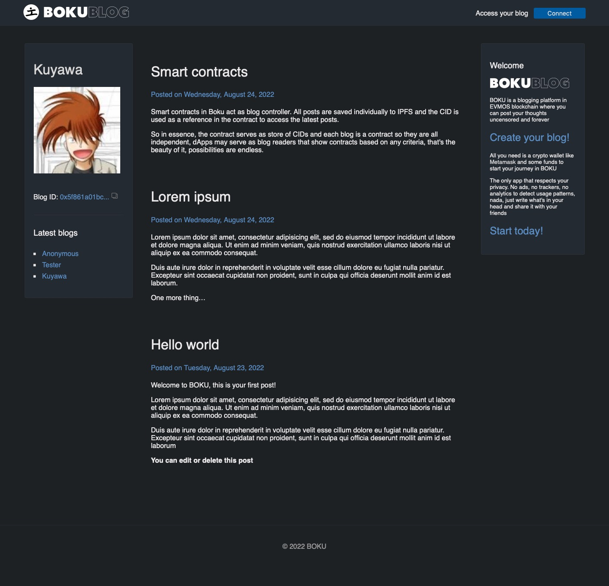

# BOKU.blog
## Blogging platform in the blockchain

[BOKU](https://boku.blog) allows you to express your thoughts without censorship, in a personal and decentralized way by posting your content to the immutability of the blockchain

[BOKU](https://boku.blog) runs on the blockchain, you will need [Metamask](http://metamask.io) in order to post content as all transactions are recorded forever

Developed using NodeJS and PostgreSQL on the server, plain HTML, JS, CSS on the client, Solidity for smart contract interaction, BOKU is participating in EVMOS Hackathon 2022

# Express yourself in [BOKU.blog](https://boku.blog)

@2022 BOKU - All rights reserved by Kuyawa